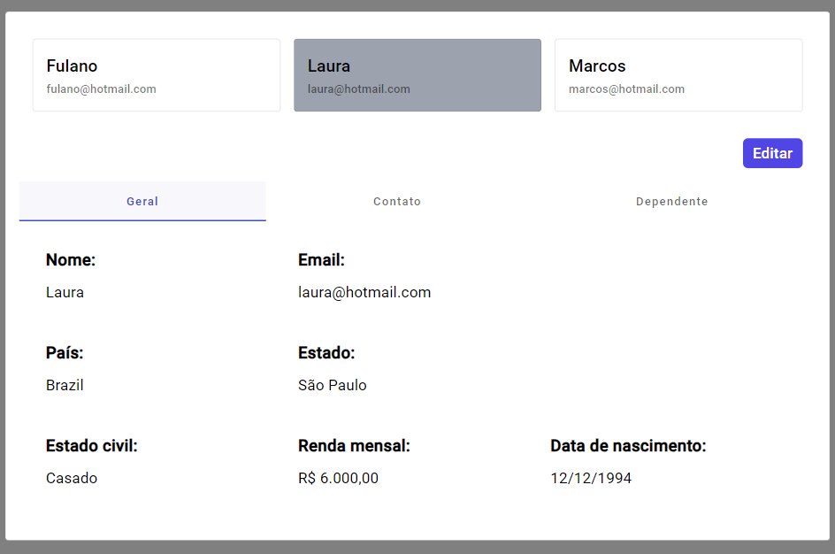
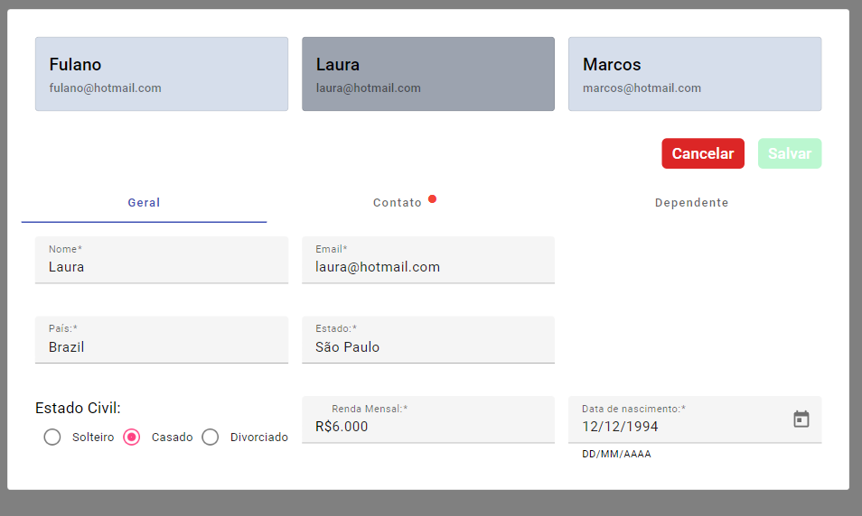
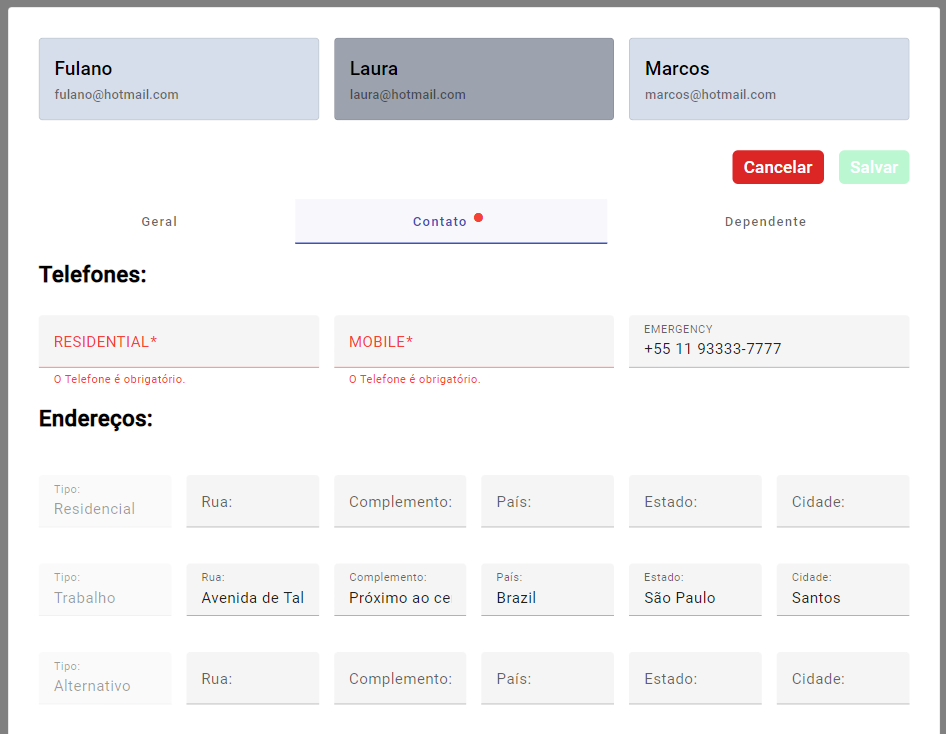

# Formulário De Usuários com Reactive Forms - Angular

Este projeto é um formulário de usuários desenvolvido durante o curso [Curso de Angular v2 ao v17: Básico ao Profissional](https://www.udemy.com/course/super-treinamento-de-angular-16-do-basico-ao-avancado/). O autor trouxe para o desenvolvimento uma situação real enfrentada em sua carreira, o que acrescentou um nível extra de desafio ao projeto.

## Estrutura e Funcionalidades
O projeto está organizado de forma a facilitar a consulta e edição dos dados de cada usuário. A simulação de uma API fictícia permite que os usuários experimentem um fluxo realista de interação. Utilizamos também a API [Postman Countries & Cities API](https://documenter.getpostman.com/view/1134062/T1LJjU52) para gerar dados de preenchimento automático de país e estado, tornando o processo mais eficiente. Além disso, o sistema possui uma formatação cuidadosa que garante tanto a acessibilidade quanto a usabilidade.

## Recursos Destacados
- Formatação Adequada: Cada campo é formatado de maneira a facilitar o preenchimento e a visualização das informações.
- Notificações Dinâmicas: Erros são sinalizados em tempo real, oferecendo feedback imediato ao usuário e melhorando a experiência geral.


## 🎯 O que aprendi:
Este projeto foi uma experiência enriquecedora. Inicialmente, pensei que seria apenas um formulário simples com informações na tela. No entanto, à medida que o desenvolvimento avançava, surgiram desafios inesperados que ampliaram minha perspectiva sobre o desenvolvimento web com Angular.
Um dos aspectos mais notáveis foi a ênfase do autor na organização e padronização do projeto. Isso me ensinou a importância de não apenas focar em lógicas e funcionalidades, mas também em como o projeto se comportará a longo prazo, facilitando manutenções e a adição de novos recursos.
Além disso, adquiri lições valiosas sobre a transferência eficiente de dados entre componentes e serviços, bem como sobre a criação de diretivas, pipes e funções utilitárias. Também desenvolvi habilidades em converter e formatar interfaces de maneira otimizada e dinâmica.


## Acesse agora a demonstração em deploy na Vercel: [Deploy Vercel](https://formulario-de-usuarios-reactive-forms-oliveiravitor32s-projects.vercel.app/)--

## 🔧 Tecnologias Utilizadas
- Angular: __17.3.8__
- Tailwindcss

## 🚀 Recursos principais:
- Consulta de usuários.
- Edição de usuários.
- Notificações de erro no formulário para melhor acessibilidade do usuário.

## Prévia
<div style="display: flex, width: 100%, flex-wrap: wrap">
    
    
    
    
</div>

## 🛠️ Instalação e Execução

Para rodar o aplicativo localmente, siga os passos abaixo:

### Clone este repositório:

```bash
  git clone https://github.com/oliveiravitor32/Formulario_de_Usuarios_Reactive_Forms-Angular.git
```

### Frontend
1. Navegue até a pasta do frontend:
   ```bash
   cd frontend
   ```
2. Instale as dependências:
   ```bash
   npm install
   ```
3. Inicie o servidor (Obs: É necessário ter o Angular CLI):
   ```bash
   ng serve
   ```
   Se você não possuir o Angular CLI instalado globalmente use:
    ```bash
   npx ng serve
    ```
    
## 📖 Uso

Após iniciar o aplicativo, acesse __http://localhost:4200__ em seu navegador.

<h2 id="license">Licença 📃 </h2>

Este projeto esta sob a licença [MIT](./LICENSE)

## Créditos
[Felipe da Silva Freitas](https://www.udemy.com/user/felipe-da-silva-freitas/)
